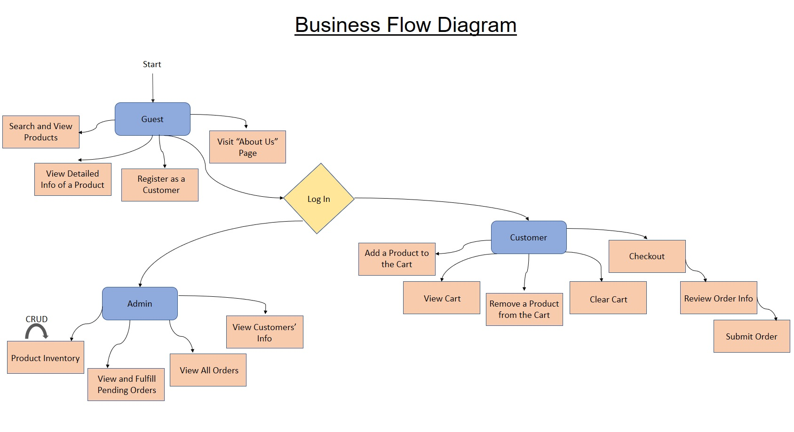

# eStore

An example e-commerce web application implemented with Java, Spring, Hibernate and MySQL. 

Based on https://github.com/KevalSanghavi/eStore

## How to Start

### Requirements

- [Eclipse for Enterprise Java Developers](https://www.eclipse.org/downloads/packages/)
- JDK8
- Tomcat
	- installed and available in Eclipse
- MySQL
	- with a new empty database named `estore`

### Steps

**Clone Repository**

`git clone https://git.uibk.ac.at/c7031224/sq-online-shop`


**Import to Eclipse**

File > Import > Maven > Existing Maven Projects

Adjust Build Path if necessary.

**Configure Database**

Adjust the connection settings for the database in the application context XML.

`src/main/webapp/WEB-INF/application-context.xml`

```xml
	<bean id="dataSource"
		class="org.springframework.jdbc.datasource.DriverManagerDataSource">
		<property name="driverClassName" value="com.mysql.jdbc.Driver" />
		<property name="url" value="jdbc:mysql://localhost:3306/estore" />
		<property name="username" value="root" />
		<property name="password" value="" />
	</bean>
```


**Build Project**

Right click on project: Run as > Maven install

**Run Project**

Right click on project: Run as > Run on Server

Access the online application at http://localhost:8080/eStore

**Create Administrator User**

After the first run, the application created the tables in the database. Now you can add the administrator `admin` with the password `admin` by executing the following SQL.

```sql
-- Authorities table:
INSERT INTO `estore`.`authorities` (`authoritiesId`, `authority`, `username`) VALUES ('1', 'ROLE_ADMIN', 'admin');

-- Users table:
INSERT INTO `estore`.`users` (`usersId`, `customerId`, `enabled`, `password`, `username`) VALUES ('1', '0', '1', '$2a$10$sTgPUNcpmNzPpNoyMoyCNOu2TISiY.kxxs7TtxyVxvQBTpXgjcqBq', 'admin');
```

## Business Flow




	
	